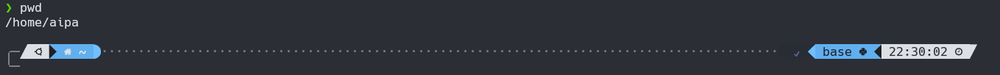
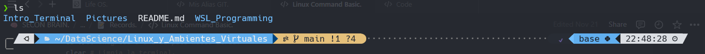
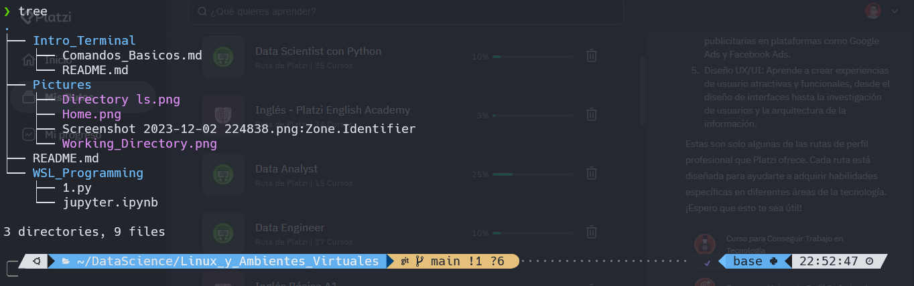

# Comandos Básicos

## Saber donde estamos 📍

Para empezar con este mundo de las terminales donde nuestra única herramienta es el teclado los y los comandos que logremos aprender lo primero que hay que hacer es saber donde estamos.

A la hora de iniciar una terminal aparecerá el símbolo " ~ " que nos indica que estamos en la carpeta home de nuestro sistema, para comprobarlo podemos poner el comando pwd que nos muestra la ruta donde estamos ubicados.



``` Bash

pwd # Muestra la carpeta donde te encuentras. 
cd ./NombreDeCarpeta  # Te permite moverte a otra carpeta u ubicación
cd ./.. #Regresa a una carpeta hacia atrás.  
cd  ~ # Te mueve a Home. ~
file ./Ruta/Archivo # Muestra la información del archivo.
clear # Limpia la terminal.

```

## Mostrando los archivos 🕵️

Cuando intentamos movernos entre directorios debemos saber a que carpeta muy bien su nombre para no equivocarnos lo importante aquí es que pasa si no nos sabemos el nombre de la carpeta (。﹏。*)?

Para eso tenemos el comando ls y tree que nos muestran las carpetas que tenemos.


a qui podemos ver como el comando ls entra en acción mostrando las carpetas que tenemos en la ruta.

mientras que el comando tree nos muestra mas a detalle el contenido de cada directorio de la siguiente manera.



Algunos de los comando que podemos usar para mostrar archivos tenemos:

```Bash

ls # mostrar archivos
ls -la  # mostrar todos los archivos incluso los ocultos
ls -lSH # muestra los archivos y el peso y edición.
ls -lr # muestra los archivos al revés de "Z a A"
tree # muestra los archivos por ramitas
tree -L 2 # muestra los archivos por 2 niveles.

```

En el caso de tree se necesita instalar.

```Bash
sudo snap install tree
```

## Las 3 Acciones Básicas : Crear, Copiar y Eliminar Archivos

Ahora que ya sabemos crear carpetas y movernos por ellas, es hora de aumentar la dificultad creando archivos, renombrarlos, copiarlos y eliminarlos.

### Crear

Empecemos con el comando para crear archivos el cual es "Touch" el cual nos permite crear archivos con su nombre y extension.

```Bash
 touch Nombre_Archivo.Extension
```

En el caso de que queramos crear una carpeta el comando es mkdir y el nombre del directorio.

```Bash
mkdir Nombre_Carpeta
```

### Mover y Renombrar

Una vez ya teniendo la manera de crear un archivos y nos equivocamos en el nombre del archivo (´。＿。｀) pero no queremos eliminarlo porque ya tiene contenido.

Lo que podemos hacer en estos casos es cambiar el nombre del archivo lo cual se puede hacer con el comando mv.

```Bash
mv Nombre_Archivo.ext Nuevo_Nombre.ext
```

Esto también aplica a carpetas no solo a archivos, el comando mv no solo renombra archivos también puede moverlos a otras librerías.

```Bash
mv Nombre_Archivo directorio 
```

Lo anterior permite mover archivos a otro directorio. Con todo lo que llevamos podemos crear, renombrar y mover archivos pero falta poder eliminarlos.

### Eliminar

Para eliminar archivos y carpetas usamos el comando "rm" que permite eliminar archivos tiene las siguientes opciones para eliminar archivos.

```Bash
rm Mi_Archivo # Elimina el archivo. 
rm -i Mi_Archivo # Pregunta si quiere eliminar el archivo.
rm -r Nombre_Directorio # Permite eliminar un directorio. 
rm -ri Nombre_Directorio #Elimina el directorio preguntado por los archivos que están dentro de la carpeta. 
```

Con todo lo anterior ya podemos crear, movernos, ubicarnos ,eliminar archivos entre otras cosas ya pasamos de no sabemos que estamos haciendo, a sentirnos un poco hacker en el uso de la terminal (⌐■_■)/.

Espero que estés preparado los temas que vienen te veo en el siguiente tema.

[**Explorar el Contenido de Archivos**](./Explorando_Contenido.md)

[Inicio](./README.md)
