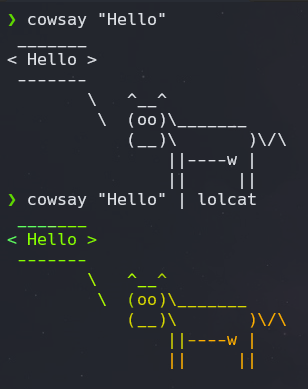
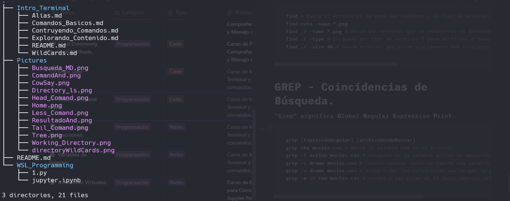
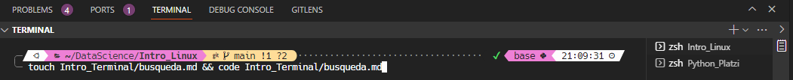
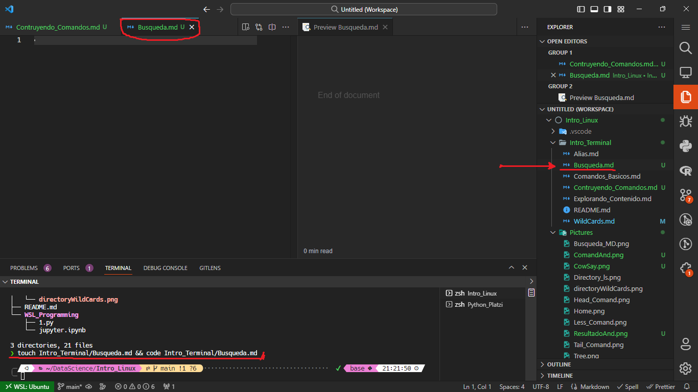

# Construyendo Comandos

Hasta ahora llevamos ya varios comandos aprendidos pero no serai genial ヾ(⌐■_■)ノ? varios comandos al mismo tiempo o uno después de otro.

Es hora de presentar la solución con los diferentes operadores que existen, pipe operator y encadenado de comandos.

## Pipe Operator ( | )

***Pipe operator*** es un operador que permite tomar la salida de un comando y pasarla como entrada de otro comando. Aprendamos más comandos que te van a ayudar.

```bash
ls cat images.txt secretos.txt | tee archivos.txt
ls | sort | tee archivos.txt # Crea un archivo con los nombres de los directorios ordenados.
```

Veamos un ejemplo, si yo imprimo cowsay nos muestra una vaquita con el dialogo que le pasemos pero si a ese comando lo mostramos como entrada para el comando lolcat esa vaquita pasara a ser de colores.



esto nos permite visualizar que el pipe operator funciona en realidad y de paso vemos una vaquitas 🐮 de por medio.

## Encadenando Comandos

Los operadores de control son símbolos reservados por la terminal que nos permiten encadenar comandos.

Si usas constantemente la tecla enter para ejecutar varios comandos, puedes evitarlo si usas el operador **;**

```bash
; # Comandos que se quieren ejecutar de manera separada, pero seguidos. 
mkdir ProyectosSecretos; ls; date # Crea una carpeta, luego muestra el directorio y por ultimo la fecha. 

& # Comando Asíncronos, se ejecutan todos al mismo tiempo pero en diferente terminal. 
date & echo "Hola" & cal # Da la fecha, dice hola y muestra el calendario.

```

## Comandos Condicionales

Estos comandos nos permiten ejecutar una orden de instrucciones en secuencia para siempre y cuando las condiciones sean verdaderas.

```bash
And -> && 
cp lp && mkdir Comida # Muestra los archivos y crea la carpeta Comida.

Or -> || 
cd ProyectosSecretos/ || cambia-carpeta Proyectos Secretos # Mueve a alguno de los 2 directorios.

> # Escribe la salida de un archivo en otro. 
>> # lo mismo que el anterior pero si no existe tal archivo lo crea. 

```

### Ejemplo de uso

En este caso queremos crear un archivo de manera rápida y a la vez abrirlo de manera simultanea par eso tenemos que crear primero el archivo y luego utilizar el comando para poder abrir el archivo. Para ello utilizaremos comandos condicionales para poder crearlo, en este caso usaremos el operador and (&&).

veamos nuestro nuestros archivos.

después ejecutaremos el siguiente comando para seguir con la serie de archivos.

```Bash
touch Intro_Terminal/Busqueda.md && code Intro_Terminal/Busqueda.md
```

Con este comando primero vamos a crear el archivo para después con visual estudio abrir el archivo para trabajar con el.





Una vez ya ejecutado tenemos la siguiente acción que podemos ver se creo el archivo de búsqueda y a su vez se esta visualizando el archivo en visual studio.

[**Búsqueda de Archivo**](./Busqueda.md)

[Inicio](./README.md)
