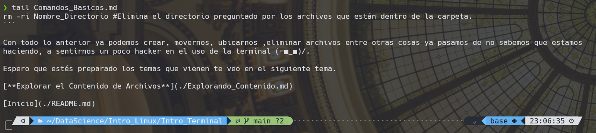
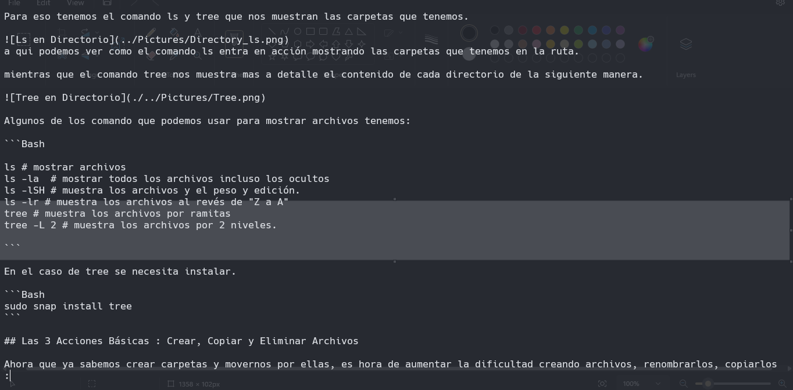

# Explorando el Contenido de los Archivos

## Ver Archivos en la Terminal

Ahora que ya sabemos hacer las operaciones básicas en la terminal a la hora de crear archivos y directorios. Es hora de empezar poder observar el contenido que llevan dentro y abrir esos archivos desde la terminal a con una aplicación predeterminada.

Ver el contenido de los archivos directamente desde la terminal es posible gracias a estos 3 comandos head, tail, less.

- Head muestra las primeras 10 lineas del archivo.
- Tail muestra las ultimas 10 lineas.
- Less muestra el archivo completo y te permite controlar la visualización del contenido.

Vamos a aterrizar estos conceptos con el siguiente ejemplo:
del archivo anterior, comandos básicos.

### Head


### Tail



### Less



Para salir del less, hay que presionar la tecla "Q".

## Abrir archivos con la aplicación predeterminada

### WSL

Para WSL, tenemos una forma de poder abrir una directorio o un archivo que es con el comando wslview.

```Bash
wslview Nombre_Archivo.extension
wslview Ubicacion_Carpeta
```

### Linux

En Linux cambia un poco ya que tenemos que usar dos comando los cuales son xdg-open y nautilus.

```Bash
xdg-open Nombre_Archivo.extension
nautilus Ubicacion_Carpeta
```

Con estos comandos podemos abrir archivos y carpetas desde la termina con una aplicación predeterminada lo cual nos permite visualizar de manera rápida el contenido de archivos.

Listo para el siguiente tema, ahora nos tocara hablar de que son los alias.
