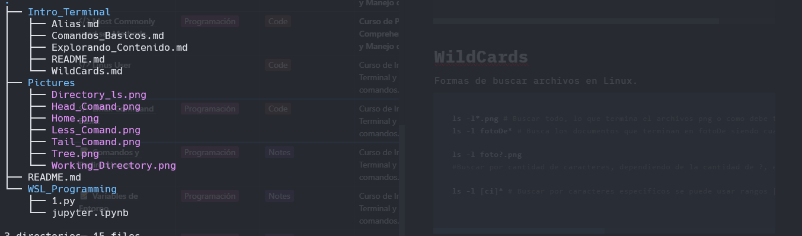
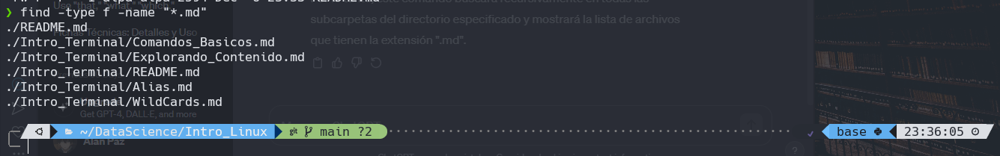

# Wild Cards

## Que son ?

Es una manera de que nos facilita la manera de  buscar archivos en Linux directamente desde la terminal.

Sus principales operadores son:

- " * " El asterisco que nos permite hacer una búsqueda a traves de la terminación del archivo (*.png)
- ? El símbolo de interrogación nos permite buscar archivos en el que varia al menos un carácter o mas dependiendo del numero de ?.
- [] Los corchetes nos permiten buscar de manera de un rango de valores que indiquemos.

### Comandos

```bash
ls -l*.png # Buscar todo, lo que termina el archivos png o como debe terminar el archivo. 
ls -l fotoDe* # Busca los documentos que terminan en fotoDe siendo cualquier extension. 

ls -l foto?.png 
#Buscar por cantidad de caracteres, dependiendo de la cantidad de ?, en este caso busca archivos foto[] y un carácter mas que termine en .png

ls -l [ci]* # Buscar por caracteres específicos se puede usar rangos [2-6], se tiene que hacer distinciones por Caracteres. 
 
```

### Ejemplos del funcionamiento

Teniendo este directorio para el funcionamiento de los diferentes códigos mostrados anteriormente.



Buscar todas los archivos que terminen en .md:



En este caso se uso el comando find, después en el tipo pusimos lo que es f de archivos y en la parte de nombre se uso el wildcard * para buscar los archivo con terminación ".md".

Este tema recomiendo practicarlo para poder aprenderlo, creando archivos y después mandarlos a buscar.

[**Construyendo Comandos**](./Contruyendo_Comandos.md)

[Inicio](./README.md)
