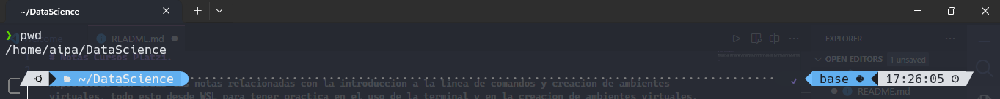

# Notas Cursos Platzi

Repositorio con todas las notas relacionadas a los cursos de introduccion a la linea de comandos y creacion de ambientes virtuales, todo esto desde WSL para tener practica en el uso de la terminal y en la creacion de ambientes virtuales.

Dejando como documentacion estos proyectos en GitHub como prueba de aprendizaje para proximos proyecto cada vez mas complejos y relacionados a Data Science ( •̀ .̫ •́ )✧

**Ruta de este repositorio.**

## Curso de Introducción a la Terminal y Línea de Comandos

La terminal y línea de comandos es una herramienta esencial para todo desarrollador de software, sin importar su área de especialización, pues se encuentra presente de forma universal. En este curso aprenderás a aprovechar el potencial de los sistemas operativos basados en UNIX siendo capaz de dominar los comandos básicos de la terminal, realizar búsquedas que agilicen tu trabajo y administrar permisos en tu equipo.

- Aprende los comandos básicos para usar la terminal.
- Personaliza tu terminal de acuerdo a las necesidades de tu - proyecto.
- Manipula archivos y directorios desde la terminal.
- Crea tus propios alias y variables de entorno para ahorrar tiempo.

## Curso de Entorno de Trabajo para Ciencia de Datos con Jupyter Notebooks y Anaconda

Conoce diferentes tipos de Jupyter Notebooks, la herramienta de trabajo fundamental para toda científica de datos que utilizarás en tus proyectos y en toda la Escuela de Data Science.

- Instala y utiliza Conda para el manejo de librerías.
- Usa notebooks en la nube como Deepnote y Colab.
- Escoge el tipo de notebook que mejor te convenga.
- Utiliza notebooks de manera local con VSCode.

### Lecciones Aprendidas

Durante estos dos cursos le perdi el miedo al manejo de la terminal y conocer los comandos mas basicos de linux ademas de instalar un subsitema linux en windows (WSL) y personalizarlo con Oh my posh entre muchas otras mas que citare rapidamente. 

- Tolerar la frustracion a que no salga como en el tutorial.
- Buscar diferente informacion y videos para llevar a cabo el obejtivo.
- Tener disciplina para llevar acabo proyectos y tener avance en el curso.
- Sentirme Hacker al usar la terminal, pero sobre todo al instalar paqueteria y ver como se instala  ( •̀ ω •́ )
